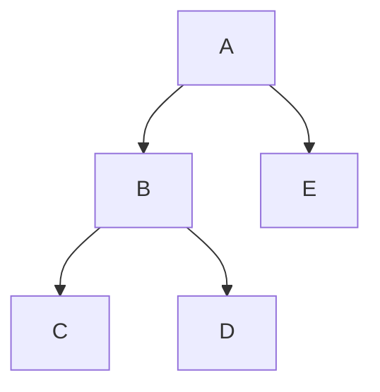

# Local Optimization

Further reading:
- Rice's [COMP512](https://www.clear.rice.edu/comp512/Lectures/02Overview1.pdf)
- Cornell's [CS 6120](https://www.cs.cornell.edu/courses/cs6120/2023fa/lesson/3/)
- CMU's [15-745](https://www.cs.cmu.edu/afs/cs/academic/class/15745-s19/www/lectures/L3-Local-Opts.pdf)
- ["Value Numbering"](https://www.cs.tufts.edu/~nr/cs257/archive/keith-cooper/value-numbering.pdf), Briggs, Cooper, and Simpson

This assigment has an associated [task](#task) you should begin after reading this lesson.

## Dead code elimination

Let's start with (trivial, global) dead code elimination as a motivating example.

"Dead code" is code that doesn't affect the "output" of a program.
Recall our discussion from [lesson 0](00-overview.md) 
 about the "obervability" of the "output" of a program
 (sorry about all the scare quotes).
In fact,
 we'll see today that the output of a (part of a) program
 is a tricky concept to pin down,
 and we'll constrain ourselves to local optimizations
 for now.

Let's start with a simple example:

```c
int foo(int a) {
    int x = 1;
    int y = 2;
    x = x + a;
    return x;
}
```

Typically, 
 we won't be working with the surface syntax of a program,
 we'll be working with a lower-level intermediate representation (IR).
Most (including the one we'll use)
 are oriented around a sequence of instructions.

Here's the same code in instruction form:
```
x = 1
y = 2
x = x + a
return x
```

In this example, the assignment to variable `y` is dead code.
It doesn't affect the output of the program,
 which is here clearly constrained as a straight line function
 that outputs a single value `x`.

Let's make things a bit more interesting:

```c
int foo(int a) {
    int x = 1;
    int y = 2;
    if (x > 0) {
        y = x;
    }
    x = x + a;
    return x;
}
```

And in instruction form:
```
    x = 1
    y = 2
    c = x > 0
    branch c L1 L2
L1: 
    y = x
L2: 
    x = x + a
    return x
```

Can you think of a way to eliminate the dead code at label `L1`?

Let's start by defining what we mean by "dead code"
 a bit more precisely so as to avoid the observability issue.
For now, an instruction is dead if both
- it is pure (has no side effects other than its assignment)
- its result is never used

For today,
 we'll only look at instructions that are pure;
 so no calls, no stores, etc.
Handling those will pose a challenge to the algorithms 
 we'll see today and we'll defer them to later.

It remains to show that a variable is never used.
A conservative approach (overapproximation is theme we'll see a lot)
 is to say that a variable is used if 
 there is no instruction that uses it.

Here's a simple algorithm to eliminate dead code
 based on this definition:
```py
used = {}
for instr in func:
    used += instr.args

for instr in func:
    if instr.dest not in used and is_pure(instr):
        del instr
```

Great! We've eliminated the dead code in the above example.

Can you think of some examples where this algorithm would fail
 to eliminate all the dead code?

Here are some different ways our code might be incomplete:
1. There's more dead code! This can be resolved by iterating until convergence.
    ```
    a = 1
    b = 2
    c = a + a
    d = b + b
    return c
    ```
2. There's a "dead store" (a variable is assigned to but never used).
    ```
    a = 1
    a = 2
    return a
    ```
3. A variable is used _somewhere_, but in a part of the code that won't actually run.
    ```c
    int a = 1;
    int b = ...;
    if (a == 0) {
        use(b);
    }
    ```

We handled the first case by simply iterating our algorithm.
The third case is a bit more challenging, and we'll see how to handle it later in the course.

How about the second case?
The third case hints that reasoning about control flow is important.
So perhaps we can make our lives easier by reasoning not doing that!
It's clear that the example in 2 is "easy" in some sense
 because we are looking at straight-line code.
So let's try to make our lives easier by looking _only_ at straight-line code,
 even in the context of a larger program.

## Control flow graphs

We'd like to reason about straight-line code whenever possible.
But even simple programs have instructions that break up this straight-line flow.

A control flow graph (CFG) is a way to represent the flow of control in a program.
It's a directed graph where the nodes 
 are "atomic" blocks of code
 the edges represent control flow between them.

One way to construct a CFG is to place every instruction in its own block.
Blocks are connected by edges
 to the instructions that might follow them.
A simple assignment instruction 
 will have one _successor_,
 one out-going edge to the next instruction.
A jump will also have one successor, to the target of the jump.
A branch will have two successors, one for each branch.

Blocks in a control flow graph are defined by a 
 "single-entry, single-exit" property.
That is, 
 there is only one point at which to enter the block (the top)
 and one point at which to exit the block (the bottom).
In other words, 
 if any part of a block is executed,
 the whole block is executed.

When we talk about basic blocks,
 in a CFG,
 we typically mean _maximal_ basic blocks.
These are blocks that are as large as possible
 while still maintaining the single-entry, single-exit property.
In our instruction-oriented IR,
 this means that a basic block is a sequence of instructions
 that may end with a _terminator_ instruction: a jump, branch, or return instruction (the exit point).
Terminators may _not_ appear in the middle of a basic block.

Here's our example from before again:
```
    x = 1
    y = 2
    c = x > 0
    branch c L1 L2
L1: 
    y = x
L2: 
    x = x + a
    return x
```

In this example, the basic blocks are the entry block, `L1`, and `L2`.
Why can't `L1` be combined with `L2`?
After all, `L1` only has one successor, can't it be folding into `L2`?
No, that would violate the single-entry property on the resulting block.
We want to guarantee that all of the instructions in a block are executed together or not at all.

## Local Dead Code Elimination

Now that we are equipped with control flow graphs
 with maximal basic blocks,
 we can focus on it as a unit of analysis.

Recall our problem case for dead code elimination:
```
a = 1
a = 2
return a
```

Our global algorithm failed to eliminate the dead code (the first assignment to `a`) in this case.


```py
unused: {var: inst} = {}
for inst in block:
    # if it's used, it's not unused
    for use in inst.uses:
        del unused[use]
    if inst.dest 
        # if this inst defines something
        # we can kill the unused definition
        if unused[inst.dest]:
            remove unused[inst.dest]
        # mark this def as unused for now
        unused[inst.dest] = inst
```

Be careful to process uses before defs (in a forward analysis like this one).
Otherwise, instructions like `a = a + 1` will be cause problems.

Note that we still have to iterate until convergence.

Is this as good as our global algorithm above?
Certainly it's better in some use cases (like the "dead store" example).

No! Consider this case with clearly dead instruction, but one that isn't "clobbered" by a later instruction:

```c
int foo(int a) {
    if (a > 0) {
        int x = 1;
    }
    return 0
}
```

So you need both for now.

## Local Value Numbering

Value numbering is a very general optimization 
 that be extended implement a number of other optimizations, including:
- Copy propagation
- Common subexpression elimination
- Constant propagation
- Constant folding
- Dead code elimination
    - This part is a little tricky, we'll see why later.

How does LVN accomplish all of this?
These optimizations can be see as reasoning about the "final value" 
 of the block of code,
 and figuring out a way to compute that value with fewer instructions.
The problem with reasoning about the "final value" is that
 the instruction-based IR doesn't make it easy to see what the "final value" is.

- Problem 1: variable name obscure the values being used
    - graphs can help with this, we will see this later in the course.
    - "clobbered" variables will make things tricky
        - we are stuck here for now, but we will look at SSA form later in the course
    - LVN's approach, "run" the program and see what values are used!
        - build a sort of a symbolic state that keeps track of the values of variables
- Problem 2: we don't know what variables will be used later in the program
    - later lecture for non-local value numbering

Here is some pseudocode for a local value numbering pass.
Note that this is avoiding important edge cases related to clobbered variables!
Think about how you'd handle those cases.

```py
# some times all represented as one big table
# here the 4 maps force you to think about the uniqueness requirements of the keys
val2num: dict[value, num] = {}
num2val: dict[num, value] = {}
var2num: dict[var, num] = {}
num2var: dict[num, var] = {}

def add(value) -> num:
    # do the value numbering in val2num, num2val

for inst in block:
    # canonicalize the instruction's arguments by getting the 
    # value numbers currently held by those vars
    args = [var2num[arg] for arg in inst.args]

    # create a new value by packaging this instruction with 
    # the value numbers of its arguments
    value = [inst.op] + args

    # look up the value number of this value
    num = val2num.get(value)

    if num is None:
        # we've never seen this value before
        num = add(value)
    else:
        # we've seen this value before
        # replace this instruction with an id
        inst.op = "id"
        inst.args = [num2var[num]]

    if inst.dest in var2num:
        # be careful here, what if dest is already in var2num?
        # one option is to introduce temp variables
        # another, more conservative option is to remove the overwritten value
        # from all of the maps and point it to the new value
    else:
        var2num[inst.dest] = value
        num2var[num] = inst.dest
```

In this approach,
 we are reconstructing each instruction based on the state at that time.
Not waiting until the end and reconstruction a whole program fragment.
One consequence of this is that we can't do DCE (we don't know what vars are used later).
 in fact we will introduce a bunch of temp vars that might be dead.
So this instance of LVN should be followed by a DCE pass.

Example:
```
a = 1
b = 2
c = 3
sum1 = a + b
sum2 = a + b
prod = sum1 * sum2
return prod
```

### Extensions of LVN

#### Stronger lookup

The important part of value numbering is when you "lookup" to see if you've seen a value before.
A typical approach is to use a hash table to see if you've done the same computation before.
But determining if two computations are the same can be done in a much less conservative way!

You could add things like commutativity, or even other properties of the operations (say `mul x 2` is the same as `add x x`).

#### Seeing through computations

Still, we aren't interpreting the instructions in a super useful way. 
For many computations, we can actually evaluate the result!
- `id` can be evaluated regardless if it's value is constant
- arithmetic operations can be evaluated if their arguments are constants
- some arith ops can be evaluated if _some_ of their arguments are constants
    - e.g., `add x 0`, `mul x 1`, `mul x 0`, `div x 1`, `sub x 0`
- what other ops can be evaluated in certain cases?
    - `eq x x`?

#### Clobbered variables

Our pass above hints at a conservative approach we took to clobbered variables, 
 in which clobbered variables clobber the values from the state, so they can't be reused later!
Here's a simple example:
```
x = a + b
x = 0
y = a + b
return y
```

You can take another approach that introduces temporary variables to handle clobbered variables.
Give it a try if you feel up to it!
We will see later that SSA (single static assignment) form 
 is a way to ensure that we can deal with this issue once and for all.

#### Dead code elimination

Currently our LVN pass introduces a bunch of dead code and relies on a DCE pass to clean it up.
One way to view value numbering is that it's building up a graph of computations
 done in a block,
 and re-emiting instructions corresponding to that graph as it goes.
Could we wait until the end of a block and try to emit the whole block at once,
 just including necessary instructions?
Not without knowing what variables are used later in the program...

#### Extended Basic Blocks

What if a basic block `A` goes straight into `B` (and `B` has no other predecessors)?
Surely we can still do _something_ that looks like value numbering?
In fact, many local analyses can be extended beyond just basic blocks by looking at _extended basic blocks_.

An extended basic block is a set of basic blocks 
 a sort of single-entry, _multiple-exit_ property.
In other words, 
 it's a set of basic blocks
 with a distinguished entry point such that:
- the entry basic block may have multiple predecessors
- but all others must have only one predecessor, which must be in the set


Here's an example EBB:


It is essentially a tree rooted at the entry block.
Any block in an EBB _dominates_ all its children.
We'll return to a more formal definition of dominance later in the course,
 but essentially it means that any path to a node in the EBB must go through all its ancestors.
This allows us to essentially reason about each path in the EBB as a single unit.
In the context of value numbering,
 we could pass the state of A's value numbering to B and then to D.
But we couldn't then pass it to C, because D doesn't run before C!
So we could optimize this EBB by looking at the path from the root to each node:
- Optimize A
    - pass the state into lvn(B)
        - pass the state into lvn(C) 
        - throw away the effects of C (or re-run lvn(A, B)), then do lvn(D)
    - throw away the effects of B (or re-run lvn(A)), then do lvn(E)

This technique can be employed to eek out a little more from your local optimizations,
 and hints a bit at the more general techniques global versions later in the course.

# Task

This course uses my fork
 of the [bril compiler infrastructure](https://github.com/mwillsey/bril/).

Your task from this lesson is to get familiar with the bril ecosystem and implement the 
3 optimizations we discussed:
1. Trival global dead code elimination
2. Local dead code elimination
    - See [here](https://github.com/mwillsey/bril/tree/main/examples/test/tdce) for some test cases relevant to dead code optimization.
3. Local value numbering
    - You must implement LVN that performs common subexpression elimination.
    - You may (but don't have to) implement some of the extensions discussed above (folding, commutativity, etc.).
    - You may choose how to handle "clobbered" variables. Just be sure to document your choice.
    - See [here](https://github.com/mwillsey/bril/tree/main/examples/test/lvn) for some test cases relevant to value numbering.

For this and other assignments, **you need not handle all of the cases identically to the examples given
 in the bril repo**.
Your optimizer should be correct (and it's up to you to argue how you know it is),
 but it may optimize less or more or differently
 than the example code.
You should, however,
 be running your optimized code through the bril interpreter 
 to ensure it outputs the same result as the original code.
The [remove_nops example](https://github.com/mwillsey/bril/tree/main/examples/remove_nops) 
 shows how to set up `brench` to run the bril interpreter on the original and optimized code and compare the results.

If you are ahead of the game (e.g., you already know about dataflow analysis),
 you are encouraged to implement more aggressive optimizations or a more general pass that subsumes the ones above.
Just be sure to include why you made the choices you did in your written reflection.

Submit your written reflection on bCourses. It should include some kind of output from the bril tools! A plot, a csv, a table, etc.

Include two short bril programs in your reflection:
1. A program that you can optimize very well with your passes. Show the unoptimized and optimized versions.
2. A program that you can't optimize with your passes, but you can in your head. What's the issue? What would you need to do to optimize it?

This task (and others) are meant to be open-ended and exploratory.
The requirements above are the minumum to get a 1-star grade, but you are encouraged to go above and beyond!
