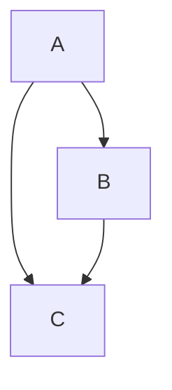
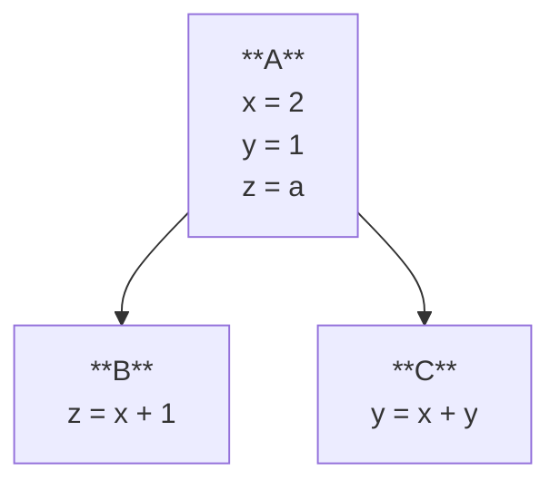
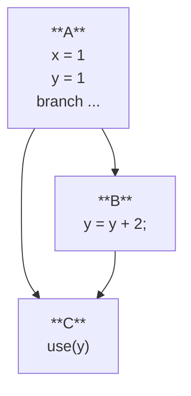
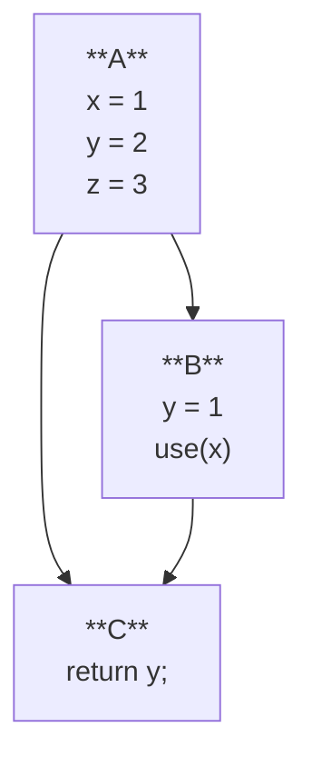

# Dataflow

Resources:
- There are many, many resources on dataflow analysis, and the terminology is pretty consistent.
  The [Wikipedia page](https://en.wikipedia.org/wiki/Data-flow_analysis) is a good starting point.
- The excellent book [_Static Program Analysis_](https://cs.au.dk/~amoeller/spa/spa.pdf) (free online) 
  is a detailed and authoritative reference. Chapter 5 deals with dataflow analysis.
- Monica Lam's CS 243 slides 
  ([part 1](https://suif.stanford.edu/~courses/cs243/lectures/L2.pdf), 
   [part 2](https://suif.stanford.edu/~courses/cs243/lectures/L3.pdf))
   from Stanford.
- Susan Horwitz's [CS704 notes](https://pages.cs.wisc.edu/~horwitz/CS704-NOTES/2.DATAFLOW.html).
- Martin Rinard's [6.035 slides](https://ocw.mit.edu/courses/6-035-computer-language-engineering-sma-5502-fall-2005/80d42de10044c47032e7149d0eefff66_11dataflowanlys.pdf) from MIT OCW.
- Lecture [notes](https://www.cs.tau.ac.il//~msagiv/courses/pa07/lecture2-notes-update.pdf) from Mooly Sagiv's course at Tel Aviv University,
  including coverage of the theoretical underpinnings of dataflow analysis like partial orderings, lattices, and fixed points.

## Control Flow Graphs

We introduced control flow graphs (CFGs) in the [previous lesson](./01-local-opt.md#control-flow-graphs),
 but for the purpose of limiting our reasoning to a single block.
Now we'll begin to consider the graph as a whole,
 and the relationships between blocks.



Recall the definitions of predecessors and successors of a basic block; 
 we'll need those later.

## Constant Propagation

Our optimizations from the previous lesson were local, in that they only considered a single block.
If we zoom in on constant propagation,
 we could only propagate constants within a single block.
Consider the following example:

```c
y = 1;
if (...) { ... }
use(y)
```

In this case, even if nothing happens to `y` in the `if` block,
 we can't propagate the constant `1` to the `use(y)` statement.

```c
y = 1;
if (...) { y = y + 2; }
use(y)
```

```c
y = 1;
if (...) { y = 1; }
use(y)
```

### As An Analysis

In value numbering, 
 we were statically executing the program
 and building up a state that represented the values of variables.
We were also simultaneously 
 modifying the program based on that state in the straight-line fashion.

For now,
 let's set aside the idea of modifying the program,
 and just focus on computing the state that represents what's happening in the program.

What is the state of constant propagation?
Something about the values of variables at each point in the program,
 and whether they are constants or not.
Perhaps a map from variables to constants.
If a variable is not (or cannot be proven to be) a constant,
 we can just leave it out of the map.

Let's try this analysis on on some straight-line code.

| instruction | `x` | `y` | `z` |
|-------------|-----|-----|-----|
| `y = 1`     |     | 1   |     |
| `z = x + 1` |     | 1   |     |
| `x = 2`     | 2   | 1   |     |
| `x = z`     |     | 1   |     |
| `y = y + 1` |     | 2   |     |

Note how we left the initial values of `x` and `z` as blank.
Similar to our value numbering analysis,
 we don't know anything about the values coming into this segment of the program.

### Extended Basic Blocks

How can we make this analysis more global?

Recall from last time that we can extend a local analysis to 
 one over [extended basic blocks](./01-local-opt.md#extended-basic-blocks)
 by passing the state from the end of one block to the beginning of the next.
The same holds for our constant propagation analysis.
For a linear path of basic blocks
 (every path in a tree that forms an EBB),
 we can pass the state from the end of one block to the beginning of the next.



Try writing out the "output" state for our constant propagation analysis
 at the end of each block.

### Joins/Meets

The key property of EBBs that allows this extension
 is that every non-rooted node has a single predecessor.
That means there's no ambiguity about which state to use when started the analysis at that node;
 you use the state from the parent in the tree (the only predecessor in the CFG).

What if we have a node with multiple predecessors?



Blocks `A` and `B` form an EBB, and we can compute their states:
- `A` says `x = 1, y = 1`
- `B` says `x = 1, y = 3` (using constant folding as well)

When we get to `C`, what state are we allowed to "start with"?
Surely we can do the same as our local analysis and start with the empty state
 where no variables are known to be constants.
But that seems to be a waste of information,
 since all of `C`'s predecessors agree on at least one value (`x = 1`).
The key is have some way to combine the information when a block has multiple predecessors.
For our constant propagation analysis,
 we can take the intersection of the states from the predecessors.

## Dataflow Analysis

Dataflow analysis is well-studied and understood
 framework for analyzing programs.
It can express a wide variety of analyses,
 including constant propagation and folding
 like we saw above.
Let's try to fit in our constant propagation analysis into the dataflow framework.

Here are the ingredients of a dataflow analysis:
1. A fact (or set of facts) you want to know at every point in the program.
    - Point in the program here means beginning or end of a block in the CFG,
      but you could also consider every instruction.
2. An initial fact for the beginning of the program. 
3. A way to compute the fact at the end of a block from the facts at the beginning of the block.
    - This is sometimes called the transfer function.
    - Sometime this is notated as $f$, so $out(b) = f(in(b))$.
    - For some analyses, you compute the beginning fact from the end fact (or both ways!).
    - For constant propagation, the transfer function is the same as the one we used for BBs/EBBs;
      a limited version of our value numbering from before.
3. A way to relate the input/output facts of a block to the inputs/outputs of its neighbors.
    - Typically this is phrased as a "join" or "meet" function that combines the facts from multiple predecessors.
    - $in(b) = meet_{p \in \text{pred}(b)} out(p)$
    - For constant propagation, the meet function is the intersection of the maps.
5. An algorithm to compute the facts at every program point such that the above equations hold.

Let's set aside how to solve the dataflow problem for now,
 and just focus on the framework.

How does constant propagation fit into this framework?
1. The fact we want to know is the mapping of variables to constants.
2. The initial fact is the empty map.
3. The transfer function is the same as our local analysis.
    - This is one of the cool parts of dataflow analysis: you are still only reasoning about a single block at a time!
4. The meet function is the intersection of the maps.
    - If the maps disagree, we just say the variable is not a constant (delete it from the map).

Once you apply the dataflow framework,
 you can define a simple, local analysis for something like constant propagation/folding,
 and extend it to a whole CFG.
The solver's that we'll discuss later can be generic across instances of dataflow problems,
 so one solver implementation can be used for many different analyses!

Try writing out the dataflow equations for the constant propagation analysis
 we did above on the CFG with blocks `A`, `B`, and `C`.

## Live Variables

Let's now switch gears to another dataflow analysis problem: liveness.
This analysis tells us which variables are "live" at each point in the program;
 that is, which variables might be needed in the future.

Consider the following code:
```c
x = 1;
y = 2;
z = 3;
if (...) { 
  y = 1; 
  use(x);
}
use(y);
```

And the corresponding CFG:


Live variables are those that might be used in the future.
Live variables is a backwards analysis:
 so we will compute the live variables for the
 beginning of each block from those live at the end of the block.
To get started,
 no variables are live at the end of the function: `out(C) = {}`.
Now we can compute `in(C)` by seeing that `y` is used in the return statement,
 so `in(C) = {y}`.

Now for blocks `A` and `B`.
This is a backwards analysis,
 so we compute the `in` from the `out` of the block, 
 and the out is derived from the `in`s of the successors.
So we can't compute `out(A)` just yet.

But `B` is ready to go, it only has one successor `C`, so `out(B) = in(C) = {y}`.
We can compute `in(B)` from `out(B) = {y}` and the block itself:
  `B` uses `x`, but it re-defines `y`, so `in(B) = out(B) + {x} - {y} = {x}`.

Now we can compute `out(A)` by combining `in(B) = {x}` and `in(C) = {y}`.
Liveness is said to be a "may" analysis,
 because we're interested in the variables that _might_ used in the future.
In these kinds of analyses,
 the meet operation is typically set union.
Thus, we can compute `out(A) = in(B) U in(C) = {x} U {y} = {x, y}`.
Finally `in(A)` is `out(A) - {x, y, z} = {}` since `A` defines `x`, `y`, and `z`.

So to fit liveness into the dataflow framework:
1. The fact we want to know is the set of live variables at the beginning/end of each block.
2. The initial fact is the empty set.
    - This is a backwards analysis, so the initial fact is the set of live variables at the end of the program.
3. The transfer function is as above.
    - This is a backwards analysis, we compute the `in` from the `out`.
    - Live variables is one of a class of dataflow problems called "gen/kill" or [bit-vector problems](https://en.wikipedia.org/wiki/Data-flow_analysis#Bit_vector_problems).
    - In these problems, the transfer function can be broken down further into two parts:
      - `gen` is the set of variables that are used in the block.
      - `kill` is the set of variables that are defined in the block.
      - special care need to be taken for variables that are both used and defined in the block.
      - `out(b) = gen(b) U (in(b) - kill(b))`
4. The meet function is set union.
    - This is a backwards analysis, so the meet function combines the successors' `in` sets to form the `out` set for a block.
    - This is a "may" analysis, so we use union to represent the fact a variable might be live in any of the successors.


## Solving dataflow

So far we haven't seen how to solve a dataflow problem.
We've sort of done it by hand, running the transfer function when its input was "ready".
This works for acyclic CFGs, you can just topologically sort the blocks and run the transfer functions in that order.
In this way, you never have to worry about the inputs the transfer function changing;
 you run every block's transfer function exactly once.

But what about CFGs with loops?

The key to solving dataflow problems is to recognize that they are fixed-point problems.
For a forward analysis on block `b`,
 we construct `in(b)` from the `out` sets of the predecessors.
 then we construct `out(b) = f(in(b))`.
This in turn changes the input to the successors,
 so we repeat the process until the `in` and `out` sets stabilize.
Another way to think about it is solving a system of equations.
Each block `b` induces 2 equations:
- $in(b) = meet_{p \in \text{pred}(b)} out(p)$
- $out(b) = f(in(b))$

Perhaps surprisingly,
 a very simple technique can be used to solve these equations
 (given some conditions on the transfer function and the domain; we'll get to those later).
We do, however, have to run some transfer functions multiple times,
 since the inputs to the transfer function can change.
A naive (but correct) solution is to simply iterate over the blocks,
 updating the `in` and `out` sets until they stabilize:
```python
for b in blocks:
  in[b] = initial
while things changed:
  for b in blocks:
    out[b] = f(b, in[b])
  for b in blocks:
    in[b] = meet(out[p] for p in pred[b])
```

This iterative approach does require some properties of the transfer function and the domain.
If you take as a given that this algorithm is correct,
 perhaps you can deduce what those properties are!

1. The algorithm specifies neither the order in which the blocks are processed,
   nor the order of the predecessors for each block.
     - This suggests the meet function doesn't care about the order of its inputs.
     - The meet function is associative and commutative.
2. The stopping condition above is very simple: keep going until the `in`s and `out`s stabilize.
     - The dataflow framework uses a _partial order_ on the facts to ensure that this algorithm terminates.
     - Termination requires that the transfer function is _monotonic_, that is,
       a "better" input to the transfer function produces a "better" output:
       if $a \leq b$ then $f(a) \leq f(b)$.
     - We saw above that the meet function is associative and commutative.
       Typically, we constrain the domain to form a [lattice](https://en.wikipedia.org/wiki/Lattice_(order)),
       where the meet operation is indeed the meet of the lattice.
        - See the above link for more details on lattices, 
          but the key point is that `meet(a, b)` returns the greatest lower bound of `a` and `b`; the biggest element that is less than both `a` and `b`.
        - In the context of dataflow analysis, where lower is typically "less information",
          the meet operation gives you the best (biggest) set of facts that is less than its inputs.
     - For now, termination also requires that the lattice has _finite height_,
       so you cannot have an infinite chain of elements that are all less than each other.
       We can lift this restriction later with so-called _widening_ operators.
        - Interval analysis is an example of an analysis that requires widening.

We can exploit these properties to make the algorithm more efficient.
In particular, we can use a worklist algorithm to avoid recomputing the `out` sets of blocks that haven't changed.

Worklist algorithm (for forward analysis):
```python
for b in blocks:
  in[b] = initial
  out[b] = initial

worklist = blocks
while b := worklist.pop():
    in[b] = meet(out[p] for b in b.predecessors)
    out[b] = f(b, in[b])
    if out[b] changed:
        worklist.extend(b.successors)
```

The worklist algorithm is more-or-less the typical way to solve dataflow problems.
Note that it still does not specify the order in which blocks are processed!
While of course that doesn't matter for correctness,
 it can affect the efficiency of the algorithm.
Consider a CFG that's a DAG.
If you topologically sort the blocks,
 you can run the algorithm in either a single pass,
 or in a very silly way if you proceed in the reverse order.
The ordering typically used in practice is 
 the [reverse postorder](https://en.wikipedia.org/wiki/Data-flow_analysis#Ordering) of the blocks.

<!-- We could go even further and exploit the associativity and commutativity of the meet operation.
The purpose of the worklist is that we only recompute `in[b] = meet(...)` if `out[p]` for some predecessor `p` of `b` has changed.
But, if there are a larger number of predecessors,
 we might be recomputing the meet operation more than necessary.
  -->

### Solutions to Dataflow

The algorithms above find a fixed point, but what does that mean?
Essentially, it's which execution paths are accounted for in the analysis.

The best one is the _ideal_ solution:
 the meet of all of the programs paths that actually execute.
This is not computable in general,
 because you don't know which paths will be taken.
So the best you can do statically is called the Meet Over all Paths (MOP) solution,
 which is the meet of all paths in the CFG.
Note there are infinitely many paths in a CFG with loops,
 so you cannot compute this directly!

The algorithms above compute a fixed point to the dataflow equations.
This is typically referred to as the _least fixed point_,
 because the solution is the smallest set of facts that satisfies the dataflow equations.
When the dataflow problem is distributive (see below),
 the least fixed point is the MOP solution.

## Liveness With Loops

Let's walk through an example using the naive algorithm to do live variable analysis on the following program with a loop:

```c
int foo(int y, int a) {
  int x = 0;
  int z = y;
  while (x < a) {
    x = x + 1;
    y = y + 1;
  }
  return x;
}
```

And in the IR:
```
.entry:
  x = 0
  z = y
  jmp .header
.header:
  c = x < a
  br c .loop .exit
.loop:
  x = x + 1
  y = y + 1
  jmp .header
.exit:
  return x
```

Since live variables is a backwards analysis,
 we'll start with the empty set at the end of the program 
 use the naive algorithm over the blocks in reverse order.

| Block     | Live Out 1 | Live In 1 | Live Out 2 | Live In 2 | Live Out 3 | Live In 3 |
|-----------|------------|-----------|------------|-----------|------------|-----------|
| `.exit`   | []         | x         | "          | "         | "          | "         |
| `.loop`   | x          | x, y      | x, y, a    | x, y, a   | "          | "         |
| `.header` | x, y       | x, y, a   | x, y, a    | x, y, a   | "          | "         |
| `.entry`  | x, y       | y, a      | x, y, a    | y, a      | "          | "         |

There are some interesting things to note about this execution.

First, note how the worklist algorithm could have saved 
 revisiting some blocks once they stabilized, e.g., `.exit`.
Since `.exit` has no successors, its `out` set will never change, 
 so nobody would ever add it back to the worklist.

### Optimistic vs Pessimistic

Second, observe the intermediate values of the `in` and `out` sets, 
 especially for the `.loop` and `.header` blocks.
They are "wrong" at some point in the analysis!

In analyses like constant propagation, 
 we are constantly trying to "improve" the facts at each point in the program.
We start out knowing that nothing is a constant,
 and we try to prove that some things are constants.
We call such an analysis _pessimistic_.
It assumes the worst case scenario, and takes conservative steps along the way.
At any point, you could stop the analysis and the facts would be true, 
 just maybe not as precise as they could be if you kept going.

Liveness is an _optimistic_ analysis.
It starts with a (very) optimistic view of the facts:
 that nothing is live!
This is of course unsound if you stopped the analysis at that point;
 it would allow you to say that everything is dead!
In an optimistic analysis, 
 reaching a fixed point is necessary for the correctness of the analysis.

The dataflow framework computes optimistic and pessimistic analyses in the same way,
 but it's good to remember which one you're working with, 
 especially if you attempt to use the partial results of the analysis for optimization.

### Strong Liveness

Another thing to note about the above example is 
 that "live" code is not necessarily "needed" code.
The variable `y` is never used for anything "important", 
 but it is used in the loop (to increment itself),
 so it's marked as live.
The loop itself becomes a sort of "sink" which makes
 any self-referential assignment.

An alternative to the standard liveness analysis is _strong liveness_.
Where liveness computes if a variable is used in the future,
 strong liveness computes if a variable is used in a "meaningful" way.
In the above example, `y` would not be considered strongly live.
As we discussed in the [first lecture](./00-overview.md),
 "meaningful" is a bit of a loaded term,
 but here it's clear that `y` is not used in a way that affects the return value of the function.
Strong liveness starts from a set of instructions that are the source
 of the "meaningful" uses of variables:
 these typically include return statements, 
 (effectful) function calls,
 branches, 
 and other effects like input/output operations.
Using a variable in a standard operation like addition or multiplication
 is not inherently "meaningful",
 but it can be if the result is used in a "meaningful" way.
So using a variable `x` in strong liveness only makes `x` live
 if the operation is inherently "meaningful" or if the operation defines a variable that is used in a "meaningful" way.

In our above example,
 `y` is live but not strongly live.
Consider implementing strong liveness as an exercise; it will make your dead code elimination more effective!

## Properties of dataflow problems

In addition to optimistic/pessimistic,
 dataflow problems can be classified in a few other ways.
One common taxonomy is based on the direction of the analysis
 and the meet function.

 |          | Forwards                                                             | Backwards             |
 |----------|----------------------------------------------------------------------|-----------------------|
 | **May**  | Reaching definitions                                                 | Live variables        |
 | **Must** | Available expressions <br> Constant prop/fold <br> Interval analysis | Very busy expressions |

Another property commonly discussed is the distributivity of the transfer function over the meet operation:
`f(a meet b) = f(a) meet f(b)`.
If this property holds, the analysis is said to be _distributive_,
 and can be computed in a more efficient way in some cases.
It also guarantees that the solution found by solving the dataflow equations is the Meet Over all Paths (MOP) solution.
Dataflow problem framed in the gen/kill setting are typically distributive.
Constant propagation is a good example of a _non_-distributive analysis.
Consider the following simple blocks:
- `X: a = 1; b = 2`
- `Y: a = 2; b = 1`
- `Z: c = a + b`, where `Z`'s predecessors are `X` and `Y`.
In this case:
$$f_Z(out_X \cap out_Y) = \emptyset$$
But:
$$f_Z(out_X) \cap f(out_Y) = 
  \{a \mapsto 1, b \mapsto 2, c \mapsto 3 \} \cap 
  \{a \mapsto 2, b \mapsto 1, c \mapsto 3 \} =
  \{c \mapsto 3 \}
$$

# Task

Turn in on bCourses a written reflection of the below task.

Do not feel obligated to explain exactly how each analysis works (I already know!),
 instead focus on the design decisions you made in implementing the analysis,
 and presenting evidence of its effectiveness and correctness.

- Implement a global constant propagation/folding analysis (and optimization!).
  - This probably won't entirely subsume the LVN you did in the previous tasks, since you did common subexpression elimination in that.
  - But you should test and see!
- Implement a global liveness analysis and use it to global implement dead code elimination.
  - This will probably subsume the trivial dead code elimination you did in the previous task.
  - But you should test and see!
- As before, include some measurement of the effectiveness and correctness of your optimization/analysis.
  - Run your optimizations on not only the tests in the `examples/` directory,
    but also on the benchmarks in the `benchmarks/` directory.
- Optionally:
  - Implement another dataflow analysis like strong liveness or reaching definitions.
  - What properties does that analysis have? Distributive? May/must? Forward/backward? Optimistic/pessimistic?
  - Implement a generic dataflow solver that can be used for any dataflow problem.

As before, the repo includes some [example analyses and test cases](https://github.com/mwillsey/bril/tree/main/examples/test/df) you may use.
Do not copy the provided analysis; please attempt your own first based on the course material. 
You may use the provided analysis as a reference after you have attempted your own.
You may always use the provided test cases, but note that your results may differ and still be correct,
 the provided tests are checking the *exact* output the provided analysis produces.
Note how that folder includes some `.out` files which are not programs,
 but just lists of facts.
This is not a standard format,
 it's just a text dump to stdout from the analysis for `turnt` to check.