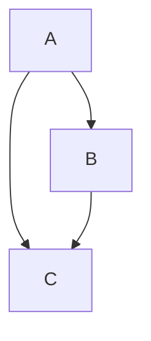
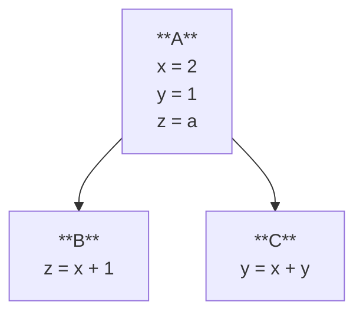
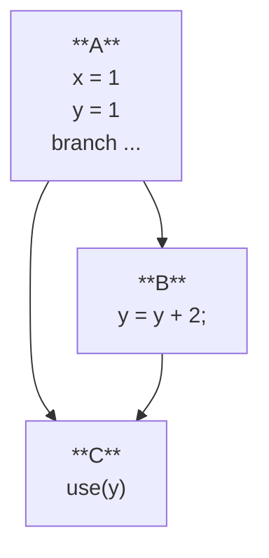
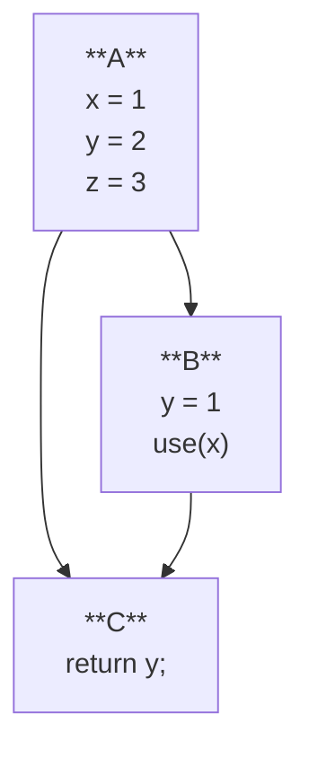

# Dataflow

Resources:
- There are many, many resources on dataflow analysis, and the terminology is pretty consistent.
  The [Wikipedia page](https://en.wikipedia.org/wiki/Data-flow_analysis) is a good starting point.
- The excellent book [_Static Program Analysis_](https://cs.au.dk/~amoeller/spa/spa.pdf) (free online) 
  is a detailed and authoritative reference. Chapter 5 deals with dataflow analysis.
- Monica Lam's CS 243 slides 
  ([part 1](https://suif.stanford.edu/~courses/cs243/lectures/L2.pdf), 
   [part 2](https://suif.stanford.edu/~courses/cs243/lectures/L3.pdf))
   from Stanford.
- Susan Horwitz's [CS704 notes](https://pages.cs.wisc.edu/~horwitz/CS704-NOTES/2.DATAFLOW.html).
- Lecture [notes](https://www.cs.tau.ac.il//~msagiv/courses/pa07/lecture2-notes-update.pdf) from Mooly Sagiv's course at Tel Aviv University,
  including coverage of the theoretical underpinnings of dataflow analysis like partial orderings, lattices, and fixed points.

## Control Flow Graphs

We introduced control flow graphs (CFGs) in the [previous lesson](./01-local-opt.md#control-flow-graphs),
 but for the purpose of limiting our reasoning to a single block.
Now we'll begin to consider the graph as a whole,
 and the relationships between blocks.



- successor, predecessor, path

## Constant Propagation

Our optimizations from the previous lesson were local, in that they only considered a single block.
If we zoom in on constant propagation,
 we could only propagate constants within a single block.
Consider the following example:

```c
y = 1;
if (...) { ... }
use(y)
```

In this case, even if nothing happens to `y` in the `if` block,
 we can't propagate the constant `1` to the `use(y)` statement.

```c
y = 1;
if (...) { y = y + 2; }
use(y)
```

```c
y = 1;
if (...) { y = 1; }
use(y)
```

### As An Analysis

In value numbering, 
 we were statically executing the program
 and building up a state that represented the values of variables.
We were also simultaneously 
 modifying the program based on that state in the straight-line fashion.

For now,
 let's set aside the idea of modifying the program,
 and just focus on computing the state that represents what's happening in the program.

What is the state of constant propagation?
Something about the values of variables at each point in the program,
 and whether they are constants or not.
Perhaps a map from variables to constants.
If a variable is not (or cannot be proven to be) a constant,
 we can just leave it out of the map.

Let's try this analysis on on some straight-line code.

| instruction | `x` | `y` | `z` |
|-------------|-----|-----|-----|
| `y = 1`     |     | 1   |     |
| `z = x + 1` |     | 1   |     |
| `x = 2`     | 2   | 1   |     |
| `x = z`     |     | 1   |     |
| `y = y + 1` |     | 2   |     |

Note how we left the initial values of `x` and `z` as blank.
Similar to our value numbering analysis,
 we don't know anything about the values coming into this segment of the program.

### Extended Basic Blocks

How can we make this analysis more global?

Recall from last time that we can extend a local analysis to 
 one over [extended basic blocks](./01-local-opt.md#extended-basic-blocks)
 by passing the state from the end of one block to the beginning of the next.
The same holds for our constant propagation analysis.
For a linear path of basic blocks
 (every path in a tree that forms an EBB),
 we can pass the state from the end of one block to the beginning of the next.



Try writing out the "output" state for our constant propagation analysis
 at the end of each block.

### Joins

The key property of EBBs that allows this extension
 is that every non-rooted node has a single predecessor.
That means there's no ambiguity about which state to use when started the analysis at that node;
 you use the state from the parent in the tree (the only predecessor in the CFG).

What if we have a node with multiple predecessors?



Blocks `A` and `B` form an EBB, and we can compute their states:
- `A` says `x = 1, y = 1`
- `B` says `x = 1, y = 3` (using constant folding as well)

When we get to `C`, what state are we allowed to "start with"?
Surely we can do the same as our local analysis and start with the empty state
 where no variables are known to be constants.
But that seems to be a waste of information,
 since all of `C`'s predecessors agree on at least one value (`x = 1`).
The key is have some way to combine the information when a block has multiple predecessors.
For our constant propagation analysis,
 we can take the intersection of the states from the predecessors.

## Dataflow Analysis

Dataflow analysis is well-studied and understood
 framework for analyzing programs.
It can express a wide variety of analyses,
 including constant propagation and folding
 like we saw above.
Let's try to fit in our constant propagation analysis into the dataflow framework.

Here are the ingredients of a dataflow analysis:
1. A fact (or set of facts) you want to know at every point in the program.
    - Point in the program here means beginning or end of a block in the CFG,
      but you could also consider every instruction.
2. An initial fact for the beginning of the program. 
3. A way to compute the fact at the end of a block from the facts at the beginning of the block.
    - This is sometimes called the transfer function.
    - Sometime this is notated as $f$, so $out(b) = f(in(b))$.
    - For some analyses, you compute the beginning fact from the end fact (or both ways!).
    - For constant propagation, the transfer function is the same as the one we used for BBs/EBBs;
      a limited version of our value numbering from before.
3. A way to relate the input/output facts of a block to the inputs/outputs of its neighbors.
    - Typically this is phrased as a "join" function that combines the facts from multiple predecessors.
    - $in(b) = join_{p \in \text{pred}(b)} out(p)$
    - For constant propagation, the join function is the intersection of the maps.
5. An algorithm to compute the facts at every program point such that the above equations hold.

Let's set aside how to solve the dataflow problem for now,
 and just focus on the framework.

How does constant propagation fit into this framework?
1. The fact we want to know is the mapping of variables to constants.
2. The initial fact is the empty map.
3. The transfer function is the same as our local analysis.
    - This is one of the cool parts of dataflow analysis: you are still only reasoning about a single block at a time!
4. The join function is the intersection of the maps.
    - If the maps disagree, we just say the variable is not a constant (delete it from the map).

Once you apply the dataflow framework,
 you can define a simple, local analysis for something like constant propagation/folding,
 and extend it to a whole CFG.
The solver's that we'll discuss later can be generic across instances of dataflow problems,
 so one solver implementation can be used for many different analyses!

Try writing out the dataflow equations for the constant propagation analysis
 we did above on the CFG with blocks `A`, `B`, and `C`.

## Live Variables

Let's now switch gears to another dataflow analysis problem: liveness.
This analysis tells us which variables are "live" at each point in the program;
 that is, which variables might be needed in the future.

Consider the following code:
```c
x = 1;
y = 2;
z = 3;
if (...) { 
  y = 1; 
  use(x);
}
use(y);
```

And the corresponding CFG:


Live variables are those that might be used in the future.
Live variables is a backwards analysis:
 so we will compute the live variables for the
 beginning of each block from those live at the end of the block.
To get started,
 no variables are live at the end of the function: `out(C) = {}`.
Now we can compute `in(C)` by seeing that `y` is used in the return statement,
 so `in(C) = {y}`.

Now for blocks `A` and `B`.
This is a backwards analysis,
 so we compute the `in` from the `out` of the block, 
 and the out is derived from the `in`s of the successors.
So we can't compute `out(A)` just yet.

But `B` is ready to go, it only has one successor `C`, so `out(B) = in(C) = {y}`.
We can compute `in(B)` from `out(B) = {y}` and the block itself:
  `B` uses `x`, but it re-defines `y`, so `in(B) = out(B) + {x} - {y} = {x}`.

Now we can compute `out(A)` by combining `in(B) = {x}` and `in(C) = {y}`.
Liveness is said to be a "may" analysis,
 because we're interested in the variables that _might_ used in the future.
In these kinds of analyses,
 the join operation is typically set union.
Thus, we can compute `out(A) = in(B) U in(C) = {x} U {y} = {x, y}`.
Finally `in(A)` is `out(A) - {x, y, z} = {}` since `A` defines `x`, `y`, and `z`.

So to fit liveness into the dataflow framework:
1. The fact we want to know is the set of live variables at the beginning/end of each block.
2. The initial fact is the empty set.
    - This is a backwards analysis, so the initial fact is the set of live variables at the end of the program.
3. The transfer function is as above.
    - This is a backwards analysis, we compute the `in` from the `out`.
    - Live variables is one of a class of dataflow problems called "gen/kill" or [bit-vector problems](https://en.wikipedia.org/wiki/Data-flow_analysis#Bit_vector_problems).
    - In these problems, the transfer function can be broken down further into two parts:
      - `gen` is the set of variables that are used in the block.
      - `kill` is the set of variables that are defined in the block.
      - special care need to be taken for variables that are both used and defined in the block.
      - `out(b) = gen(b) U (in(b) - kill(b))`
4. The join function is set union.
    - This is a backwards analysis, so the join function combines the successors' `in` sets to form the `out` set for a block.
    - This is a "may" analysis, so we use union to represent the fact a variable might be live in any of the successors.


The framing of dataflow problems in terms of forward/backward and may/must 
 is common and many analyses can be expressed in this way:

 |          | Forwards              | Backwards             |
 |----------|-----------------------|-----------------------|
 | **May**  | Reaching definitions  | Live variables        |
 | **Must** | Available expressions <br> Constant prop/fold <br> Interval analysis | Very busy expressions |


## Solving dataflow

So far we haven't seen how to solve a dataflow problem.
We've sort of done it by hand, running the transfer function when its input was "ready".
This works for acyclic CFGs, you can just topologically sort the blocks and run the transfer functions in that order.
But what about CFGs with loops?

The key to solving dataflow problems is to recognize that they are fixed-point problems.
For a forward analysis on block `b`,
 we construct `in(b)` from the `out` sets of the predecessors.
 then we construct `out(b) = f(in(b))`.
This in turn changes the input to the successors,
 so we repeat the process until the `in` and `out` sets stabilize.
Another way to think about it is solving a system of equations.
Each block `b` induces 2 equations:
- $in(b) = join_{p \in \text{pred}(b)} out(p)$
- $out(b) = f(in(b))$

A naive (but functional) solution is to simply iterate over the blocks,
 updating the `in` and `out` sets until they stabilize:
```python
for b in blocks:
  in[b] = initial
while things changed:
  for b in blocks:
    out[b] = f(b, in[b])
  for b in blocks:
    in[b] = join(out[p] for p in pred[b])
```

Worklist algorithm (for forward analysis):
```python
for b in blocks:
  in[b] = initial
  out[b] = initial

worklist = blocks
while b := worklist.pop():
    in[b] = join(out[p] for b in b.predecessors)
    out[b] = f(b, in[b])
    if out[b] changed:
        worklist.extend(b.successors)
```

### Properties of dataflow problems

todo

# Task
(under construction)

- Implement a global constant propagation/folding analysis (and optimization!).
- Optionally:
  - Implement another dataflow analysis like liveness or reaching definitions.
  - Implement a generic dataflow solver that can be used for any dataflow problem.