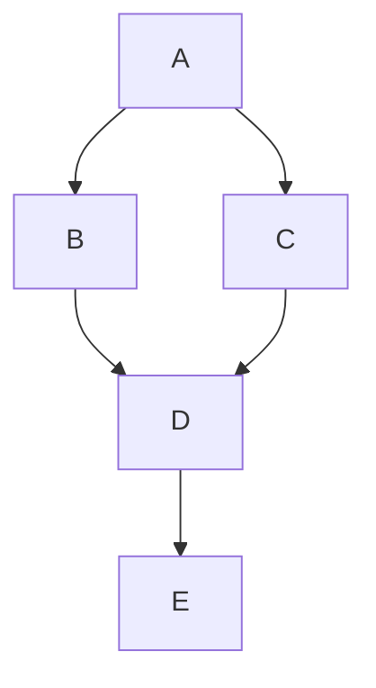
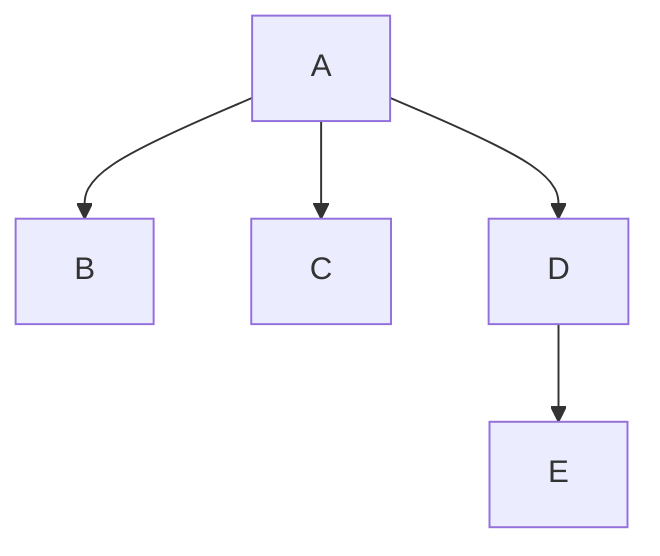

# Static Single Assignment (SSA) Form

As you've undoubtedly noticed,
 re-assignment of variables
 has been a bit painful.

We also saw in last week's paper
 a peek at SSA
 and how it can enable and even power-up optimizations
 by allowing a "sparse" computation of dataflow.

In this lesson, we'll dive into SSA
 and see how it works
 and how to convert a program into SSA form.

Resources:
- Lots has been written about SSA, the [Wikipedia page](https://en.wikipedia.org/wiki/Static_single_assignment_form) is a good start.
- The [_SSA Book_](https://pfalcon.github.io/ssabook/latest/book-full.pdf) (free online) is an extensive resource.
- Jeremy Singer's [SSA Bibliography](https://www.dcs.gla.ac.uk/~jsinger/ssa.html) is a great resource for papers on SSA,
  and Kenneth Zadeck's [slides](https://compilers.cs.uni-saarland.de/ssasem/talks/Kenneth.Zadeck.pdf) on the history of SSA are a good read as well.
- This presentation of SSA follows the seminal work by Cytron et al, [Efficiently computing static single assignment form and the control dependence graph](https://dl.acm.org/doi/pdf/10.1145/115372.115320).
    - The Cytron algorithm is still used by many compilers today.
    - A more recent paper is "Simple and Efficient Construction of Static Single Assignment Form", by Braun et al., which is [this week's reading](../reading/braun-ssa.md).

## SSA

SSA stands for "Static Single Assignment".
The "static" part means that each variable is assigned to at precisely one place in the program text.
Of course dynamically, in the execution of the program, a variable can be assigned to many times (in a loop).
The "precisely one" part is a big deal!
This means that at any use of a variable,
 you can easily look at its definition,
 no analysis necessary.

This creates a nice correspondence between the program text and the dataflow in the program.
- definition = variable
- instruction = value
- argument = data flow edges

This is a step towards a graph-based IR! 
In fact, LLVM and other compilers use pointers to represent arguments in the IR.
So instead of a variable being a string, it's a pointer to the instruction that defines it (because it's unique!).

### Straight-Line Code

Let's look at SSA conversion starting with simple, straight-line code.

```c
x = 1;
x = x + 1;
y = x + 2;
z = x + y;
x = z + 1;
```

For straight-line code like this,
 SSA is easy.
You can essential walk through the code
 and rename each definition to a new variable
 (typically like `x_1`, `x_2`, etc).
When you see a use, 
 you update that use to the most recent definition.

```c
x_1 = 1;
x_2 = x_1 + 1;
y_1 = x_2 + 2;
z_1 = x_2 + y_1;
x_3 = z_1 + 1;
```

### Branches

Easy peasy! But what about control flow?
Here we encounter the $\phi$ ("phi") function,
 which we saw defined in last week's paper.
The $\phi$ function arises
 from situations where control flow _merges_, 
 and a variables may have been assigned to in different ways.
An `if` statement is a classic example.

```c
int x;
if (cond) {
    x = 1;
} else {
    x = 2;
}
use(x);
```

And in the IR:

```
    ....
    br cond .then .else
.then:
    x = 1;
    jump .end
.else:
    x = 2;
    jump .end
.end:
    use x
```

SSA is "static" single assignment,
 so even though only one of the branches will be taken,
 we still need to rename `x` differently in each branch.
Say `.then` defines `x_1` and `.else` defines `x_2`.
What do we do at `.end`, which `x` do we use?

We need a $\phi$ function!

```
    ....
    br cond .then .else
.then:
    x_1 = 1;
    jump .end
.else:
    x_2 = 2;
    jump .end
.end:
    x_3 = phi .then x_1 .end x_2 
    use x_3
```

In Bril, 
 the `phi` instruction takes 2 variables and 2 labels 
 (they can be mixed up, due to the JSON representation storing registers and labels separately).
In some literature, they write it without the labels: $\phi(x_1, x_2)$.
That's just the same, 
 since in SSA a variable is defined in exactly one place.
In Bril it's just a bit more explicit.

The `phi` instruction gives us a way to merge dataflow from different branches.
Intuitively, it's like saying "if we came from `.then`, use `x_1`, if we came from `.else` use `x_2`".
It's called "phi" because it's a "phony" instruction,
 not a real computation,
 it only exists to enable use to use SSA form.
The Bril interpreter is actually capable of executing `phi` instructions,
 but in a real setting, they are eliminated (see below).

### Loops

Loops is SSA form are similar to branches. 
The interesting points are basic blocks with multiple predecessors.

Here's a simple do-while loop:
```c
int x = 0;
do {
    x = x + 1;
} while (cond);
use(x);
```

In the IR:

```
    ...
    x = 0;
    jump .loop
.loop:
    x = x + 1;
    cond = ...;
    br cond .loop .end
.end:
    use x
```

Here, `.loop` is the point where control flow merges, much like the block after an `if`.
And in SSA form:

```
    ...
    x_1 = 0;
    jump .loop
.loop:
    x_3 = phi .loop x_1 .loop x_2
    x_2 = x_3 + 1;
    cond = ...;
    br cond .loop .end
.end
    use x_2
```

Note the ordering of the `x` vars.
It's not necessary to have them in any order,
 but it suggests the order in which we "discovered" that we need a $\phi$ there.
First we did the renaming,
 and then we went around the loop and saw that we needed to merge the 
 definition of `x` from the header and that of the loop body.

### Where to Put $\phi$ Functions

Where do we need to put $\phi$ functions?
We have approached this informally for now. 
Our current algorithm is to do a forward-ish pass, 
 renaming and introducing $\phi$ functions "where they are necessary".

A simple way to think about it is in terms of live variables and reaching definitions
 (recall these from the dataflow lesson).
Certainly where phis are necessary is related to control flow merges.
A form of SSA called "trivial SSA"
 can be constructed by inserting $\phi$ functions at every join point for all live variables.

But we can do better than that.
Even at a join point, we don't need a $\phi$ function for every variable.
Consider a CFG with a diamond shape, it should be the case at uses after the branches merge 
 can refer to definition from before the branches diverged without needing a $\phi$ function.
This leads us to "minimal SSA",
 where we only insert $\phi$ at join points 
 for variables that that multiple reaching definitions.

An alternative way 
 (and one used more frequently since it avoid having to compute liveness)
 to place $\phi$ functions is to consider _dominators_.

## Dominators

The key concept we need is that of dominators.
Node $A$ in a CFG _dominates_ node $B$ if every path from the entry to $B$ goes through $A$.

Recall an extended basic block is a tree of basic blocks.
In an EBB, the entry node dominates all the other nodes.

What about for slightly more complex CFGs?


Above is a simple CFG with a diamond shape, perhaps from an `if` statement.
Let's figure out which nodes dominate which.
Hopefully it's intuitive that `A` dominates `B` and `C`, since it has to run directly before them.
`A` also dominates `D`, since every path to `D` goes through `A`.
You can also view this inductively: `D`'s predecessors are `B` and `C`, and `A` dominates both of them, and so `A` dominates `D` as well.
Domination is a reflexive relation, so `A` dominates itself.
Therefore, `A` dominates all the nodes in this CFG.

What about `B` and `C`? Do they dominate `D`?
No!
For example, the path `A -> C -> D` does not go through `B`, so `B` does not dominate `D`.
Similarly, `C` does not dominate `D`.
And finally, `D` does not dominate `B` or `C`.

So the complete domination relation is:
- `A` dominates `A`, `B`, `C`, and `D`
- `B` dominates `B`
- `C` dominates `C`
- `D` dominates `D`

How does domination help us with $\phi$ functions?
So far, it tells us where we _don't_ need $\phi$ functions!
For example, any definition in `A` does not need a $\phi$ function for any use in `A`, `B`, `C`, or `D`, since `A` dominates all of them.
Intuitively, if a definition is guaranteed to run before a use, we don't need a $\phi$ function.

### Computing Dominators

How do we compute dominators?
The naive algorithm is to compute the set of dominators for each node.
The formula for the dominators of a node $b$ is:
$$ \text{dom}(b) = \{b\} \cup \left(\bigcap_{p \to b} \text{dom}(p)\right) $$

Note that the above is the things that dominate $b$, not the things that $b$ dominates!

This formula captures exactly the intuition above! 
A block $b$ dominates itself, and it dominates a block $c$ iff every predecessor of $c$ is dominated by $b$.

This looks a bit like a dataflow equation, and in fact you can compute dominators using a fixed-point algorithm 
 in the same fashion!
Just iterate the above equation until you reach a fixed point.

Computing dominators in this way is $O(n^2)$ in the worst case,
 but if you visit the nodes in reverse postorder, it's $O(n)$.

### Dominator Tree

A convenient and compact way to represent the dominator relation is with a dominator tree.
Some algorithms in compilers will want to traverse the dominator tree directly.
To build one,
 we need a couple more definitions:
- $A$ _strictly dominates_ $B$ if $A$ dominates $B$ and $A \neq B$.
- $A$ _immediately dominates_ $B$ if $A$ strictly dominates $B$ _and_ $A$ does not strictly dominate any other node that strictly dominates $B$.

The _dominator tree_ is a tree where each node is a basic block,
 and the parent of a node is the immediate dominator of that node.
This also means that for any subtree of the dominator tree,
 the root of the subtree is dominates of all the nodes in the subtree.

Example CFG:



And the dominator tree:



### Dominance Frontier

The final concept we need is the _dominance frontier_.
Essentially, the dominance frontier of a node $A$ is the set of nodes "just outside" of the ones that $A$ dominates.

More formally, $B$ is in the dominance frontier of a node $A$ if both of the following hold:
- $A$ does _not_ dominate $B$
- but $A$ _does_ dominate a predecessor of $B$

## Converting Into SSA

To convert a program into SSA form,
 we are going to use the dominance frontier to guide where to place $\phi$ functions.
First, we place these "trivial" $\phi$ functions, without doing any renaming.
Then, we rename all the variables.

### Place the $\phi$ Functions

The dominance relation tells us where we _don't_ need $\phi$ functions for a definition:
 if a definition dominates a use, we don't need a $\phi$ function.
But just outside of that region, we do need $\phi$ functions.

(convince yourself of this! if $A$'s dominance frontier contains $B$, then $B$ is a join point for the control flow from $A$)

We begin by placing trivial $\phi$ functions that look like `x = phi x .source1 x .source2` at these points.
In general, a phi function will take a number of arguments equal to the number of predecessors of the block it's in.
So make sure your initial, trivial $\phi$ functions reflect that.
 


```py
DF[b] = dominance frontier of block b
defs[v] = set of blocks that define variable v
for var in variables:
    for defining_block in defs[var]:
        for block in DF[defining_block]:
            insert_phi(var, block) if not already there
            defs[var].add(block)
```

Note that this is "minimal SSA", but the some of these $\phi$ instructions may still be dead.
Minimal SSA refers to having no "unneccessary" $\phi$ functions,
 (i.e., no $\phi$ functions that are dominated by a single definition).
 but it's still possible to have some that are dead.
There are other variants of SSA like pruned SSA that try to eliminate these dead $\phi$ functions.
Your dead code elimination pass should be able to remove these just fine.

### Rename Variables

Now that we have $\phi$ functions at the right places,
 we can rename variables to ensure that each definition is unique,
 and that each use refers to the correct definition.

```py
stack[var] = [] # stack of names for each variable
dom_tree[b] = list of children of block b in the dominator tree
              i.e., blocks that are *immediately* dominated by b
def rename(block):
    remember the stack

    for inst in block:
        inst.args = [stack[arg].top for arg in inst.args]
        fresh = fresh_name(inst.dest)
        stack[inst.dest].push(fresh)
        inst.dest = fresh
    for succ in block.successors:
        for phi in succ.phis:
            v = phi.dest
            update the arg in this phi corresponding to block to stack[v].top
    for child in dom_tree[block]:
        rename(child)

    restore the stack by popping what we pushed
```

If you're in a functional language, you can use a more functional style and pass the stack around as an argument.

Note that when you update the phi argument, if you don't have a name on the stack, then you should just rename it to something undefined to indicate that indeed the variable is not defined when coming from that predecessor.

## Converting Out of SSA

Converting out of SSA is a much simpler.
An easy way to remove all the $\phi$ functions
 is to simply insert a copy instruction at each of the arguments of the $\phi$ function.

```
.a:
    x_1 = 1;
    jump .c
.b:
    x_2 = 2;
    jump .c
.c:
    x_3 = phi .a x_1 .b x_2
    use x_3
```

Becomes:

```
.a:
    x_1 = 1;
    x_3 = x_1;
    jump .c
.b:
    x_2 = 2;
    x_3 = x_2;
    jump .c
.c: 
    # phi can just be removed now
    use x_3
```

This is quite simple, but you can see that it introduces some silly-looking copies.

There are many techniques for removing these copies (some of your passes might do this automatically).
You can also use a more sophisticated algorithm to come out of SSA form to prevent introducing these copies in the first place.
Chapter 3.2 of the [SSA Book](https://pfalcon.github.io/ssabook/latest/book-full.pdf) has a good overview of these techniques.


# Task

There is no task for this lesson.
Later lectures and tasks will sometimes assume that you can convert to SSA form.

If you implement SSA conversion in your compiler
 (I highly recommend it!),
 tell me about it in whichever task you first use it.


