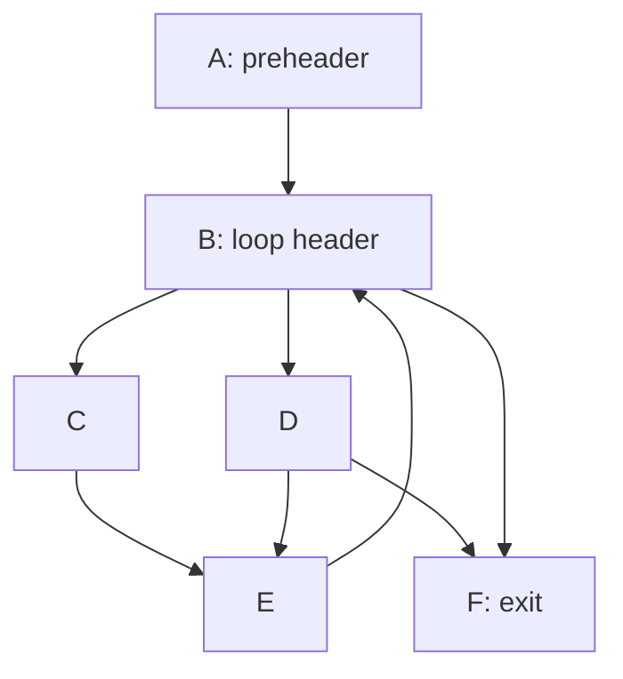
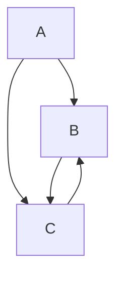
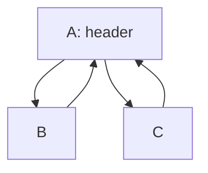
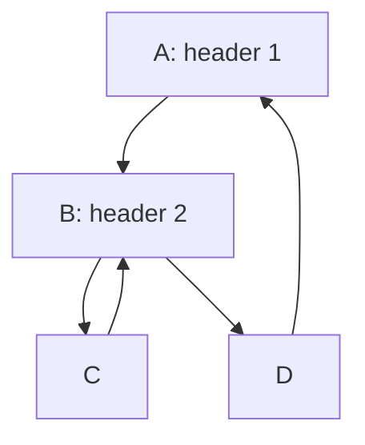
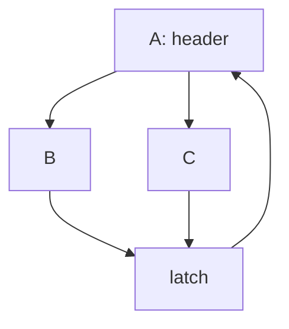
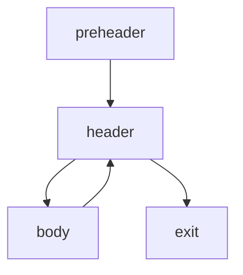
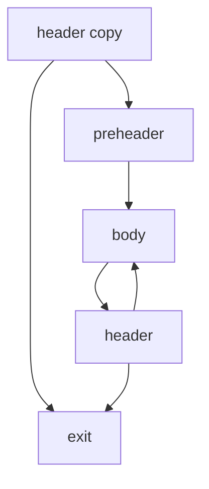
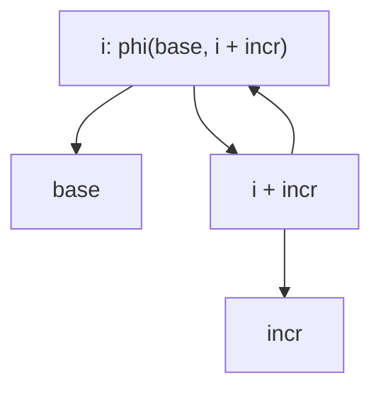
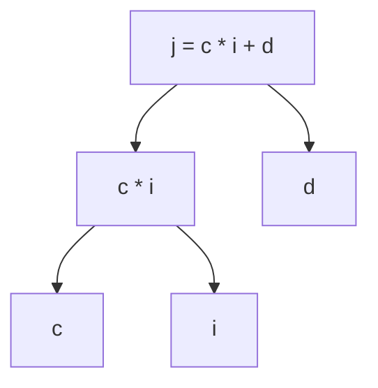

# Loop Optimization

Loop optimizations are a key part of optimizing compilers.
Most of a program's execution time will be spent on loops,
 so optimizing them can have a big impact on performance!

Resources:
- [LICM](http://www.cs.cmu.edu/afs/cs/academic/class/15745-s19/www/lectures/L9-LICM.pdf) 
  and [induction variable](https://www.cs.cmu.edu/afs/cs/academic/class/15745-s19/www/lectures/L8-Induction-Variables.pdf)
  slides from CMU's 15-745
- [Compiler transformations for high-performance computing](https://dl.acm.org/doi/10.1145/197405.197406), 1994
    - Sections 6.1-6.4 deal with loop optimizations
- Course notes from Cornell's CS 4120 on [induction variables](https://www.cs.cornell.edu/courses/cs4120/2019sp/lectures/27indvars/lec27-sp19.pdf)

## Natural Loops

Before we can optimize loops, we need to find them in the program!

Many optimizations focus on so-called _natural loops_, loops 
 with a single entry point.

In this CFG, there is a natural loop formed by nodes A-E.



Some things to observe:
- A natural loop has a _single entry point_, which we call the _loop header_
    - the loop header dominates all nodes in the loop!
    - this makes the loop header essential for loop optimizations
- Frequently, a loop will have a _preheader_ node
    - this is a node that is the _only_ predecessor of the loop header
    - useful for loop initialization code
    - if there is no preheader, we can create one by inserting a new node
- The loop may have many exits

The following is not a natural loop, because there is no single entry point.



Natural loops also allow us to classify certain edges in the CFG as _back edges_.
A back edge is an edge in CFG from node A to node B, where B dominates A.
Every back edge corresponds to a natural loop in the CFG!
In the natural loop example above, the edge from E to B is a back edge.
Note how the non-natural loop example has no back edges!

### Reducibility

An alternative and more general definition of a 
 loop in a CFG would be to look for strongly-connected components.
However, this is typically less useful for optimization.
In this class, we will focus on natural loops.

A CFG with only natural loops is called _reducible_.
If you're building a compiler from a language with structured control flow,
 (if statements, while loops, etc),
 the CFG will be reducible.
If you have arbitrary control flow (like goto), you may have irreducible CFGs.

There are techniques to reduce an irreducible CFG to a reducible one,
 but we won't cover them in this class.
The vast majority of programs you will encounter will have reducible CFGs.
We'll only talk about optimizing natural loops, and you may just ignore the non-natural loops for now.

### Nested and Shared Loops

Natural loops may share a loop header:



And they may be nested:



In the nested loop example,
 node C is in the inner loop defined by the back edge from C to B,
 but is it in the outer loop?
The outer loop is defined by the back edge from D to A.

We define a natural loop in terms of the back edge that defines it.
It's the smallest set of nodes that:
- contains the back edge that points to the loop header
- has no predecessors outside the set
    - except for the predecessors of the loop header

By this definition, node C _is_ in the outer loop! 
It is a predecessor of B,
 which is not the loop header of the outer loop.

### Finding Natural Loops

Armed with that definition, we can find natural loops in a CFG.
We will go about this by first finding back edges, then finding the loops they define.

1. Compute the dominance relation
2. Find back edges (A -> B, where B dominates A)
3. Find the natural loops defined by the back edges
   - if backedge does from N -> H (header)
   - many ways to find to loop nodes
       - find those nodes that can reach N without going through H
       - those nodes plus H form the loop

### Loop Normalization

It may be convenient to normalize the structure of loops
 to make them easier to optimize.
For example, LLVM normalizes loops to have the following structure:
- Pre-header: The sole predecessor of the loop header
- Header: The entry point of the loop
- Latch: A single node executed for looping; the source of the back edge
- Exit: An exit node that is guaranteed to be dominated by the header

You might find it useful to do some normalization.
In particular, you may want to add a preheader if it doesn't exist,
 as it's a convenient place to put loop initialization code.
You may also want loop headers (and pre-headers) to be unique to a loop,
 that way a loop is easily identified by its header.

Consider the following CFG where two natural loops share a header:


You could normalize by combining the two loops into one:


## Loop Invariant Code Motion (LICM)

A classic loop optimization is _loop invariant code motion_ (LICM),
 which is a great motivation for finding and normalizing loops with a pre-header.

The goal is to move code out of the loop that doesn't depend on the loop iteration.
Consider the following loop:

```c
i = 0;
do {
    i++;
    c = a + b;
    use(c);
} while (cond);
```

The expression `a + b` is loop invariant, as it doesn't change in the loop.
So we could get some savings by moving it out of the loop:

```c
i = 0;
c = a + b;
do {
    i++;
    use(c);
} while (cond);
```

### Requirements for LICM

Why does the above example work? And why does it use a do-while loop instead of a while loop?
1. Moving the code doesn't change the semantics of the program
    - watch out for redefinitions of the same variable in a loop!
    - if you're SSA, it's a bit easier
2. The moved instruction dominated all loop exits
    - in other words, it's guaranteed to execute!

Requirement 2 is why we use a do-while loop.
In a while loop, none of the code in the body is guaranteed to execute,
 so none of it dominates all loop exits.
Many loops won't look like this,
 so what can you do?

The first approach is to ignore the second requirement.
On one hand, this will allow you to directly implement LICM on while loops.
On the other hand,
 you now have some new performance _and_ correctness issues to worry about.
Suppose the example above was a while loop.
Even though `c = a + b` is loop invariant,
 it's not guaranteed to execute.
So if `cond` is false on the first iteration,
 we will have make our program worse by moving the code out of the loop!

Even worse, what if the operation was something more complex than addition?
If it has side effects, we have changed the meaning of the program!
Still, this can be a useful optimization in practice
 if you're careful to limit it to pure, side-effect-free code.

### Loop Splitting/Peeling

Another approach to enabling LICM (and some other loop optimizations)
 is to perform _loop splitting_, sometimes called _loop peeling_.
The effect is to convert a while loop into a do-while loop:

```c
while (cond) {
    body;
}
```

becomes

```c
if (cond) {
    do {
        body;
    } while (cond) 
}
```

In CFG form, the while loop:



becomes the do-while loop:



Note that in the converted do-while loop, the block labeled body is actually the natural loop header for the loop.
Once in this form, code from the block labeled `body` (actually the header) dominates all loop exits,
 so you can apply LICM to it.

In loops like do-while loops, 
 you can even perform LICM on some code that is side-effecting, 
 as long as those side effects are idempotent.
A good example would be division.
In general, 
 it's not safe to move division out of a loop
 if you consider crashing the program to be a side effect 
 (you could also make it undefined behavior).
But in a loop of this structure, 
 you can move loop invariant divisions into the preheader.

Another way to phrase this transformation is that
 code in the loop header dominates all loop exits automatically.
So can be easier to move loop invariant code out of header of a loop than out of other nodes.
Loop splitting can be seen as a way to make more loop code dominate loop exits;
 in simple cases it essentially turns the loop body into the loop header.

### Finding Loop Invariant Code

Now it just remains to identify which code is loop invariant.
This too is a fixed point, but specific to the code in a loop.

We will limit ourselves to discussing the SSA form of the code.
If you're not in SSA form, you'll have to do some extra work 
 to reason about reaching definitions and avoiding redefinitions.

A value is loop invariant 
 if it will always have the same value through out the execution of the loop.
Loop invariance is a property of a value/instruction with respect to a particular loop.
In nested loops, some code may be loop invariant with respect to one loop,
 but not another.

A value (we are in SSA!) is loop invariant if either:
- It is defined outside the loop
- It is defined inside the loop, and:
    - All arguments to the instruction are loop invariant
    - The instruction is deterministic

The last point is important. 
Consider the instruction `load 5` which loads from memory location 5.
Is that loop invariant? 
It depends on if the loop changes memory location 5!
We can maybe figure that out with some kind of analysis,
 but for now, we will consider that loads and stores cannot be loop invariant.

This definition should give you enough to iterate to a fixed point!

## Induction Variables

Another quintessential elements of a loop in an _induction variable_,
 typically defined as a variable that is incremented or decremented by some constant amount each iteration.

Consider the following C code:
```c
// a is an array of 32-bit ints
for (int i = 0; i < N; i++) {
    a[i] = 42;
}
```

And in a (non-bril) IR
```
    i = 0
.loop.header:
    c = i < N
    branch c .loop.body .loop.exit
.loop.body:
    offset = i * 4
    addr = a + offset
    store 42 addr
    i = i + 1
    jump .loop.header
.loop.exit:
    ...
```

In the above code, 
 `i` is the loop counter,
 and in this case it is also an so-called _basic induction variable_
 since it is incremented by a constant amount each iteration.
The variables `offset` and `addr` are _derived induction variables_,
 since they are a function of the basic induction variable.
Typically we restrict these deriving functions to be linear with respect to the basic induction variables:
 so of some form `j = c * i + d` where:
- `j` is the derived induction variable
- `i` is the basic induction variable
- `c` and `d` are loop invariant with respect to `i`'s loop (typically constants)

Loop induction variables are part of a couple classic loop optimizations, 
 namely induction variable elimination and strength reduction[^1]
 which we will discuss in the next section.
But they are also important for unrolling, loop parallelization and interchange, and many other loop optimizations.

[^1]: Sometimes people use "strength reduction" to refer to the more general optimization of replacing expensive operations with cheaper ones, even outside of loops. Sometimes it's used specifically to refer to this optimization with respect to induction variables.
 

In the above example,
 the key observation is that `addr = a + i * 4`, and `a` is loop invariant.
This fits one of a set of commons patterns that allows us to perform a "strength reduction", 
 replacing the relatively expensive multiplication with a cheaper addition.
Instead of multiplying by 4 each iteration, we can just add 4 each iteration, and initialize `addr` to `a`.

```
    i = 0
    addr = a
.loop.header:
    c = i < N
    branch c .loop.body .loop.exit
.loop.body:
    store 42 addr
    addr = addr + 4
    i = i + 1
    jump .loop.header
```

Above I've also removed some dead code for the old calculation of `addr`.
Now we can observe that `addr` is now a basic induction variable
 instead of a derived induction variable.

Great, we've optimized the loop by removing a multiplication!
But we can go further by observing that `i` is now only used to compute the loop bound.
We can instead compute the loop bound in terms of `addr`, which allows us to eliminate `i` entirely.

```
    i = 0
    addr = a
    bound = a + N * 4
.loop.header:
    c = addr < bound
    branch c .loop.body .loop.exit
.loop.body:
    store 42 addr
    addr = addr + 4
    jump .loop.header
```

Loop optimized!


### Finding Basic Induction Variables

Of course to do any optimization with induction variables,
 you need to be able to find them.
There are many approaches,
 and we will read about one
 in the paper "[Beyond Induction Variables](../reading/beyond-induction-variables.md)".

I will discuss an approach based on SSA, you can also take a dataflow approach, 
 which the Dragon Book and these [notes from Cornell](https://www.cs.cornell.edu/courses/cs4120/2019sp/lectures/27indvars/lec27-sp19.pdf) cover quite well.
The dataflow approach is quite elegant and worth looking at!
It operates with a lattice based on maps from variables to triples: `var -> (var2, mult, add)`.
These dataflow approaches are totally compatible with SSA form
 (and SSA makes them easier to implement since you don't have to worry about redefinitions).
I will instead discuss a simple approach that directly analyzes the SSA graph,
 as SSA makes basic induction variable finding quite easy.

We begin by looking for basic induction variables of the form `i = i + e` where `e` is some loop invariant expression. 
If you're just getting started, you can limit yourself to constant `e`s.

The essence of finding induction variables in SSA form is to look for cycles in the SSA graph.
For a basic induction variable, you're looking for a cycle of the form `i = phi(base, i + incr)`.
Graphically:



### Finding Derived Induction Variables

For derived induction variables `j`, you're looking for a pattern of the form `j = c * i + d` where `c` and `d` are loop invariant and `i` is a basic induction variable.
Induction variables derived from the same basic induction variable are said to be in the same _family_ as the basic induction variable.
Again, you can limit yourself to constant `c` and `d` to start.
We can do this with a dataflow analysis as well, but we will stick to directly inspecting the SSA graph.

Note that you will need to consider separate patterns for the commutative cases, and cases where one of `c` or `d` is 0.



### Replacing Induction Variables

The purpose of limiting ourselves to simple linear functions is that we 
 can easily replace derived induction variables with basic induction variables.

For a derived induction variable `j = c * i + d`:
- `i` is a basic induction variable, with base `base` and increment `incr`
- Initialize `j0` to `c * base + d` in the preheader.
- In the loop, redefine `j` to `j = phi(j0, j + c * incr)`
    - `c * incr` is definitely loop invariant, probably constant!

### Replacing Comparisons

In many cases, once you replace the derived induction variables,
 the initial basic induction variable is only needed to compute the loop bounds.
If that's the case,
 you can replace the comparison to operate on another induction variable from the same family.

Consider `i < N` as a computation of a loop bound.
And say we have a derived induction variable `j = c * i + d`.
Some simple algebra gives us the transformation:
```
    i     <     N
c * i + d < c * N + d
j         < c * N + d
```

So we can replace the comparison `i < N` with `j < c * N + d`.
With that, a dead code analysis will be able to eliminate `i` entirely (if it's not used elsewhere).

### Induction Variable Families

In general, induction variables in the same family can be expressed in terms of each other.
As we saw above, a derived induction variable can be "lowered" into it's own basic induction variable as well
 via strength reduction,
 so basic induction variables can be expressed in terms of each other sometimes as well.
This opens up a wider question/opportunity for optimization:
 for a family of induction variables, 
 what do we want to do?
We could try to eliminate all but one of the basic induction variables,
 or we could try to replace all derived induction variables with basic induction variables.

These have different trade-offs:
 more basic induction variables may mean better strength reduction,
 but it can also increase register pressure, as you have more variables to keep live across the loop.
On the other hand, you can imagine trying to "de-optimize" code in the reverse process,
 trying to express as many derived induction variables as possible in terms of a single basic induction variable.
LLVM [does such a thing](https://llvm.org/doxygen/classllvm_1_1Loop.html#ae731e6e33c2f2a9a6ebd1d51886ce534)
 in fact it tries to massage the loop to have a single basic induction variable that starts at 0 and increments by 1.

The classic strength reduction optimization as we discussed above is a case where the trade-off is very favorable.
We begin with 1 basic (`i`) and 2 derived induction variables (`offset` and `addr`).
 and we end up with 1 basic induction variable (`addr`) only.

# Task

This task will be to implement _some kind_ of loop optimization.
It's up to you! 
If you aren't sure,
 consider doing a basic LICM implementation,
 as it has a good payoff for the effort.

As always, run your optimizer on the entire benchmark suite in `benchmarks/`.
Make sure to include some kind of summary statistics (average, min/max... or a plot!) in your writeup.
