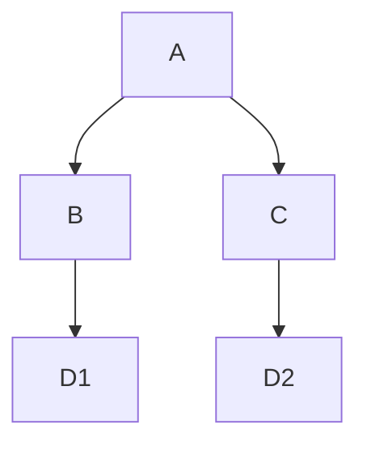
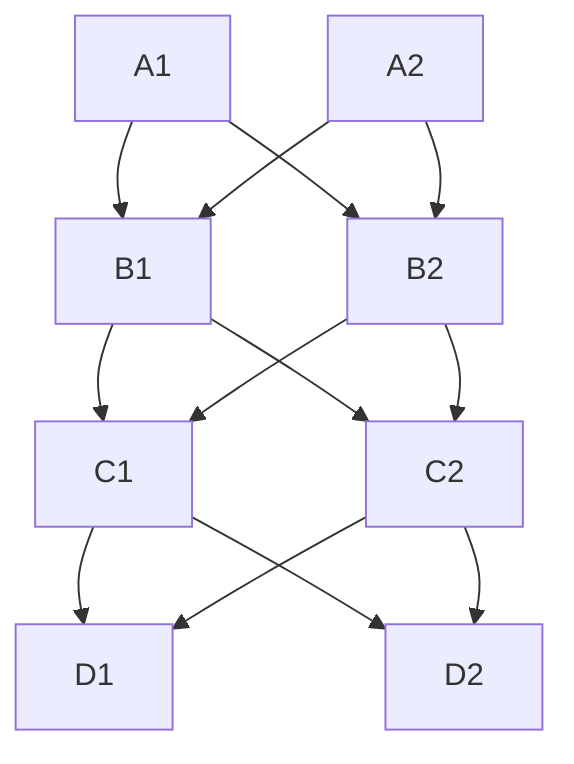
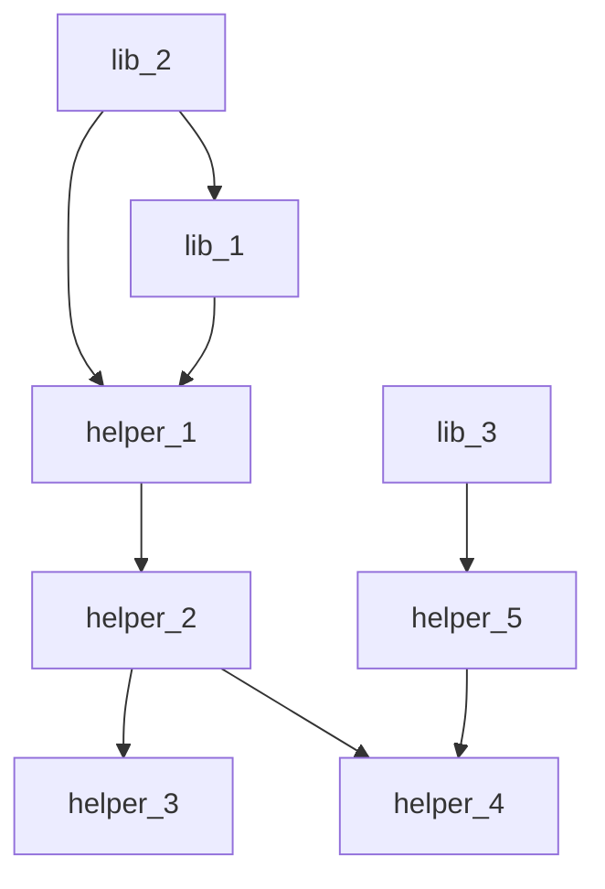

# Interprodural Optimization and Analysis

Most of the techniques we have discussed so far have been limited to a single function.
But we have, however, made the jump from reasoning about a single basic block to reasoning about a whole function.
Let's recap how we did that.

## Intraprocedural: Local to Global

A local analysis or optimization doesn't consider any kind of control flow.
To extend beyond a single basic block, 
 we needed to figure out how to carry information from one block to another.

Consider the following CFG:

As we saw in the first lesson about [extended basic blocks](./01-local-opt.md#extended-basic-blocks),
 you can "for free" reuse the information from a block the dominates you (for a forward analysis).
In the above example, blocks B and C can reuse information from block A since they are both dominated by A.
In fact, similar for block D, but you'd have to be a little careful about variable redefinitions.
But how do we get information from blocks B and C into D?

### The Problem with Paths

First of all, what's even the problem here? Why is hard to reason about block D?
The issue that is that our analysis is attempted to summarize all possible executions of a program up to a point.
And when there are joins in the control flow,
 there are multiple paths that could have led to that point.
When there are cycles, there are infinitely many paths!
So the issue with global (and as we'll see later, interprocedural)
 analysis is that we need to handle multiple or potentially infinite paths of execution in the state of our analysis.

### Summarize

The main approach that we took in this class was to summarize the information from multiple paths
 using the monotone framework of dataflow analysis.
When control converges in a block (i.e. there are multiple ways to get to a block),
 we combine the analysis results from each path using a "meet" operation.
This meet operation has nice algebraic properties
 that ensure we can always do this without spinning out of control in, for example, a loop.
However, it loses information!
Recall that some analyses, like constant propagation, 
 are not distributive over the meet operation.

In our dataflow analyses, 
 we have both optimistic and pessimistic analyses.
An optimistic analysis might result in more precision,
 but you have to wait until it's converged (until all paths have been considered)
 before you can trust the results.
A pessimistic analysis might be less precise,
 but you can trust the results at any point in the analysis.
We will see this tradeoff again in interprocedural analysis and the open-world assumption.

### Duplicate

The other approach (that we briefly discussed) is to copy!
If you simply duplicate block D:

Then you can apply the analysis to D2, and then merge the results back into D.
In this case, you could actually merge blocks D1 and D2 back into their predecessor blocks.
In an acyclic CFG, you can always do this, eliminating any convergence at potentially exponential cost.
Here's the pessimal CFG to duplicate that witnesses the exponential explosion:

An of course, CFGs with cycles cannot be fully duplicated in this way, since there are infinitely many paths.

But! You can always partially apply this technique and combine it with summarization.
Loop unrolling is a classic example of this technique.
Practical application of basic block duplication (in acyclic settings) will also
 only do this sometimes, leaving the rest to the summarization technique.

### Contextualize

This is very similar to duplication,
 but instead of exploding the graph,
 you keep track of some context
 (in the case of a CFG, the path that led to the block)
 in the analysis state.
Of course, there are infinitely many paths in a cycle,
 so you have to be careful about how you do this.
A common approach is to finitize the context,
 for example by only keeping track of the last few blocks that led to the current block.
For a global dataflow analysis, this approach is called _path-sensitive analysis_.
We saw call-site sensitivity in the context of interprocedural analysis
 in last week's reading on the [Doop framework](../reading/doop.md).

## Interprocedural Analysis

Of course, most programs are not just a single function.
The interaction between functions is modeled by the _call graph_,
 very similar to the control flow graph can basic blocks.

Let's saw I have a library that defines some public functions `lib_N` with private helpers `helper_N`:

In a CFG, one of the basic optimization is dead code elimination (on the block level).
If a block is not reachable from the entry block, then it is dead code.
But if you're compiling a library, you don't know what the entry block is, since you don't know what the user's program will look like.

### Open World

This is the main challenge of interprocedural analysis: **the open-world assumption**.
In most compilation settings, 
 you don't know what the whole program looks like.
There are a couple main reasons for this, which roughly fall into two categories:
- separate compilation
    - where parts of the program are compiled separately and then linked together
    - this enables you to compile and distribute libraries
    - also useful for faster, incremental compilation
- dynamic code
    - even worse, you might not know what the whole program looks like at runtime
    - in many programming languages, you can load code at runtime
    - so you might not know what the whole program looks even once the program is running!

Thankfully, 
 many of the techniques we've discussed so far can be extended to interprocedural analysis, 
 even in the open world setting using similar techniques over the call graph.
But summarization must be pessimistic, since you don't know what the whole program looks like.

### Closed World

Some, like dead code analysis, don't really work in the open world setting since they need to be optimistic.
There are some settings where you can in fact do whole-program analysis
 where you can make the **closed-world assumption**.
The big ones are:
- [LTO](https://en.wikipedia.org/wiki/Interprocedural_optimization#WPO_and_LTO) or link-time optimization. Even when the program is separately compiled,
  there is typically a final linking step where you can see the whole program. Modern compilers like GCC and LLVM will do some optimizations at this stage.
- JIT (just-in-time) compilation. In this case, the compiler is present at runtime! 
  This gives the compiler the superpower of *making assumptions*. The compiler can basically assume anything it wants about the program as long as it can check it at runtime. If the assumption is true, great, you can use the code optimized for that assumption. If not, you can fall back to the unoptimized code.

### Summarize

Summarization is hugely weakened in the open-world setting. Optimistic analyses are not sound, but pessimistic analyses are still okay. 

